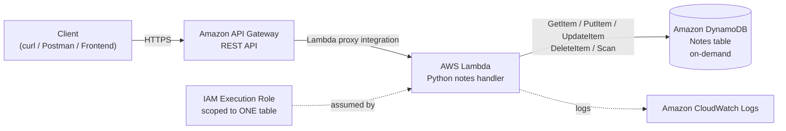
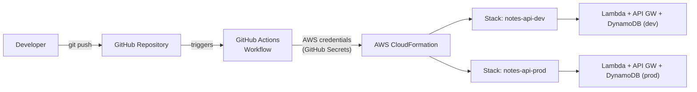
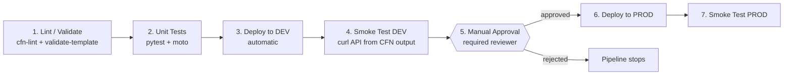
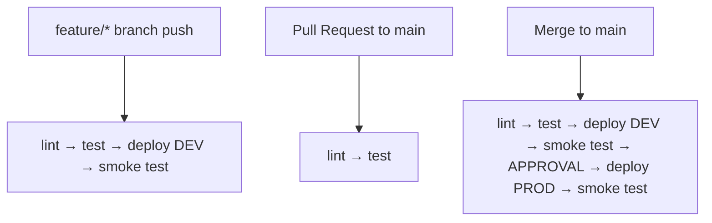
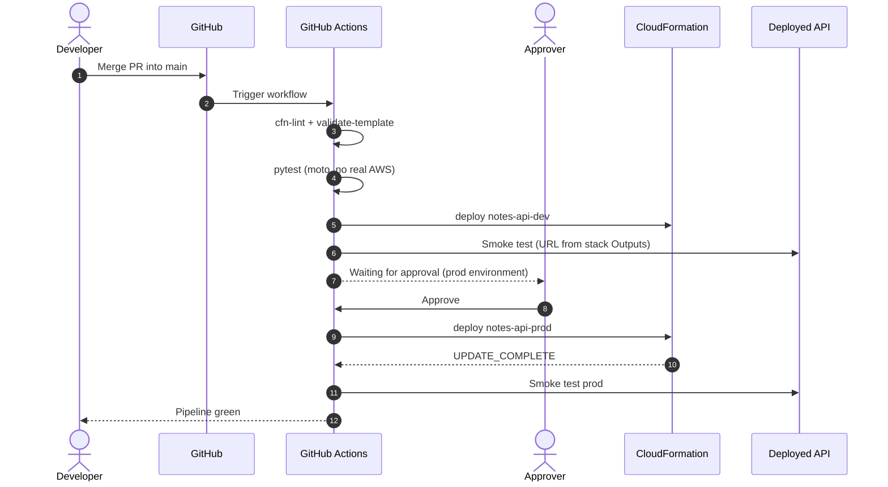
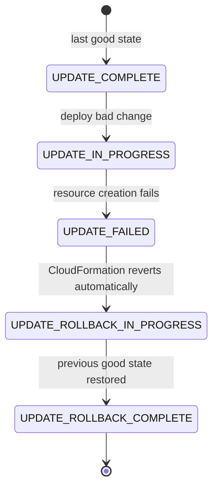
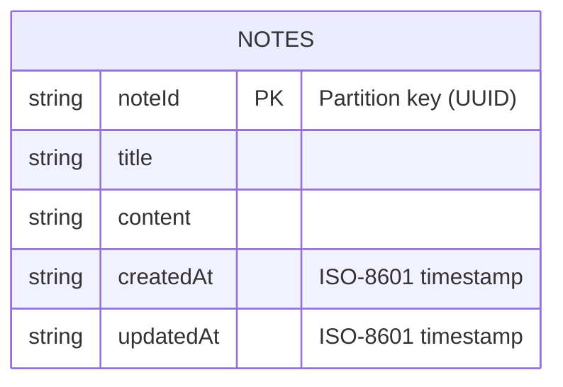

# Serverless Notes API — CloudFormation + DynamoDB + CI/CD

A fully serverless **Notes CRUD API** on AWS (**API Gateway + Lambda + DynamoDB**), where the *entire* infrastructure is defined in **AWS CloudFormation** and delivered through a production-style **CI/CD pipeline** (lint → test → deploy dev → smoke test → manual approval → deploy prod), including a **proven automatic rollback**.


---

## Table of Contents

1. [Project Overview](#1-project-overview)
2. [Architecture](#2-architecture)
3. [Tech Stack](#3-tech-stack)
4. [Repository Structure](#4-repository-structure)
5. [API Reference](#5-api-reference)
6. [Data Model (DynamoDB)](#6-data-model-dynamodb)
7. [Step-by-Step Implementation](#7-step-by-step-implementation)
   - [Part 0 — Prerequisites](#part-0--prerequisites)
   - [Part 1 — Local setup, Lambda code and unit tests](#part-1--local-setup-lambda-code-and-unit-tests)
   - [Part 2 — CloudFormation template](#part-2--cloudformation-template)
   - [Part 3 — Least-privilege IAM user for the pipeline](#part-3--least-privilege-iam-user-for-the-pipeline)
   - [Part 4 — CI/CD pipeline](#part-4--cicd-pipeline)
   - [Part 5 — Rollback test](#part-5--rollback-test-mandatory)
   - [Part 6 — Cleanup](#part-6--cleanup)
8. [Security and Least Privilege](#8-security-and-least-privilege)
9. [Evidence and Results](#9-evidence-and-results)
10. [Troubleshooting](#10-troubleshooting)
11. [Key Learnings](#11-key-learnings)
12. [License](#12-license)

---

## 1. Project Overview

| Item | Detail |
|---|---|
| **Goal** | Deploy a serverless CRUD API with 100% Infrastructure-as-Code and an automated, gated delivery pipeline |
| **App** | Notes API (create / read / list / update / delete) |
| **IaC** | AWS CloudFormation (single template, `dev` and `prod` via parameters) |
| **CI/CD** | GitHub Actions (lint, test, deploy, smoke test, manual approval for prod) |
| **Database** | DynamoDB, on-demand (`PAY_PER_REQUEST`) |
| **Cost** | Free-tier friendly: Lambda (1M requests/month free), DynamoDB (25 GB free). No EC2, NAT Gateway or ALB |

> **Note:** The original task description mentions GitLab CI/CD. The exact same pipeline design (stages, protected credentials, manual production gate) was implemented with **GitHub Actions**, using *Environments with required reviewers* as the equivalent of a GitLab manual job.

### What this project demonstrates

- Infrastructure defined once, deployed twice (`dev` and `prod`) using CloudFormation **parameters**
- **Least-privilege IAM** for both the Lambda execution role and the CI/CD user
- **Shift-left quality**: `cfn-lint` and `validate-template` run before any deploy
- **Mocked unit tests** (moto): no real AWS resources touched during tests
- **Manual approval gate** before production
- **Post-deploy smoke test** that reads the API URL from CloudFormation **Outputs** (no console clicking)
- **Automatic rollback** on failed stack updates, captured in logs and stack events

---

## 2. Architecture

### 2.1 Application architecture



### 2.2 Delivery architecture (how code reaches AWS)



### 2.3 CI/CD pipeline stages



### 2.4 Branch and environment strategy



### 2.5 Production deploy sequence



### 2.6 Rollback behavior



---

## 3. Tech Stack

| Layer | Technology |
|---|---|
| Compute | AWS Lambda (Python 3.12) |
| API | Amazon API Gateway (REST, Lambda proxy) |
| Database | Amazon DynamoDB (on-demand) |
| IaC | AWS CloudFormation (YAML) |
| CI/CD | GitHub Actions |
| Testing | pytest, moto (AWS mocking) |
| Linting | cfn-lint, `aws cloudformation validate-template` |
| Access control | IAM least-privilege policies |

---

## 4. Repository Structure

```text
serverless-notes-api/
├── .github/
│   └── workflows/          # GitHub Actions pipeline (lint, test, deploy, smoke, approval)
├── src/                    # Lambda function source code
├── tests/                  # Unit tests (moto-mocked DynamoDB)
├── conftest.py             # Shared pytest fixtures
├── requirements-dev.txt    # Dev/test dependencies (pytest, moto, boto3, cfn-lint)
├── template.yaml           # CloudFormation template (DynamoDB, Lambda, IAM, API Gateway)
├── cicd-policy.json        # Least-privilege IAM policy for the pipeline user
├── .gitignore
├── LICENSE                 # MIT
└── README.md
```

---

## 5. API Reference

Base URL (from the CloudFormation output `ApiEndpoint`):

```text
https://<api-id>.execute-api.<region>.amazonaws.com/<stage>
```

| Method | Path | Description | Success | Errors |
|---|---|---|---|---|
| `POST` | `/notes` | Create a note | `201` | `400` invalid body |
| `GET` | `/notes` | List all notes | `200` | `500` |
| `GET` | `/notes/{id}` | Get one note | `200` | `404` not found |
| `PUT` | `/notes/{id}` | Update a note | `200` | `400`, `404` |
| `DELETE` | `/notes/{id}` | Delete a note | `200` / `204` | `404` |

### Error handling

| Status | When | Example body |
|---|---|---|
| `400` | Missing or invalid input (bad JSON, missing field) | `{"error": "title is required"}` |
| `404` | Note ID does not exist | `{"error": "Note not found"}` |
| `500` | Genuine internal failure | `{"error": "Internal server error"}` |

Raw Lambda stack traces are **never** returned to the client. They are logged to CloudWatch only.

### Example requests

```bash
export API_URL="https://<api-id>.execute-api.<region>.amazonaws.com/<stage>"

# Create
curl -s -X POST "$API_URL" \
  -H "Content-Type: application/json" \
  -d '{"title":"First note","content":"Hello from serverless"}'

# List
curl -s "$API_URL"

# Get one
curl -s "$API_URL/<note-id>"

# Update
curl -s -X PUT "$API_URL/<note-id>" \
  -H "Content-Type: application/json" \
  -d '{"title":"Updated title","content":"Updated content"}'

# Delete
curl -s -X DELETE "$API_URL/<note-id>"
```

---

## 6. Data Model (DynamoDB)



- **Billing mode:** `PAY_PER_REQUEST` (no capacity planning, free-tier friendly)
- **Partition key:** `noteId` (String). Every access pattern of this API is by note ID (get, update, delete), so a single partition key gives evenly distributed, O(1) lookups.
- **List operation:** implemented as a `Scan`, which is acceptable for a small demo dataset. For large datasets, a GSI or a query-oriented key design would replace it.

---

## 7. Step-by-Step Implementation

### Part 0 — Prerequisites

| Tool | Purpose | Check |
|---|---|---|
| AWS account | Free tier is sufficient | n/a |
| AWS CLI v2 | Talk to AWS | `aws --version` |
| Python 3.12+ | Lambda runtime + tests | `python3 --version` |
| Git + GitHub account | Source control + CI/CD | `git --version` |
| GitHub CLI (optional) | Set secrets from terminal | `gh --version` |

Configure the AWS CLI with an **admin/bootstrap** identity only for the one-time setup of the least-privilege pipeline user (Part 3):

```bash
aws configure
aws sts get-caller-identity
```

---

### Part 1 — Local setup, Lambda code and unit tests

**Step 1.1 — Clone the repository**

```bash
git clone https://github.com/sonujha78/serverless-notes-api.git
cd serverless-notes-api
```

**Step 1.2 — Create a virtual environment and install dev dependencies**

```bash
python3 -m venv .venv
source .venv/bin/activate
pip install -r requirements-dev.txt
```

**Step 1.3 — Run the unit tests**

The tests use **moto**, so DynamoDB is fully mocked and no AWS resources are touched.

```bash
pytest -v
```

Expected result:

```text
tests/test_notes.py::test_create_note_success PASSED
tests/test_notes.py::test_create_note_invalid_body_returns_400 PASSED
tests/test_notes.py::test_get_note_success PASSED
tests/test_notes.py::test_get_note_not_found_returns_404 PASSED
tests/test_notes.py::test_update_note PASSED
tests/test_notes.py::test_delete_note PASSED
============================ all tests passed ============================
```

---

### Part 2 — CloudFormation template

`template.yaml` defines everything in one file:

| Resource | Purpose |
|---|---|
| `AWS::DynamoDB::Table` | Notes table (on-demand, table name includes the environment) |
| `AWS::IAM::Role` | Lambda execution role, DynamoDB access limited to **this table's ARN** (no wildcard) |
| `AWS::Lambda::Function` | Notes API handler |
| API Gateway resources | REST API, `/notes` and `/notes/{id}` routes, Lambda proxy integration |
| `Outputs` | `ApiEndpoint` (consumed by the pipeline) |

**Parameters** allow one template to produce both environments:

| Parameter | Values | Effect |
|---|---|---|
| `EnvName` | `dev` / `prod` | Suffix for resource names and stage name |
| `LambdaMemory` | e.g. `128` (dev), `256` (prod) | Different sizing per environment |

**Step 2.1 — Lint the template**

```bash
cfn-lint template.yaml
```

No output means no errors. Then validate with AWS itself:

```bash
aws cloudformation validate-template --template-body file://template.yaml
```

**Step 2.2 — Deploy the dev stack manually (first-time sanity check)**

```bash
aws cloudformation deploy \
  --template-file template.yaml \
  --stack-name notes-api-dev \
  --parameter-overrides EnvName=dev \
  --capabilities CAPABILITY_IAM \
  --no-fail-on-empty-changeset
```

Expected result:

```text
Waiting for changeset to be created..
Waiting for stack create/update to complete
Successfully created/updated stack - notes-api-dev
```

**Step 2.3 — Read the API URL from stack Outputs (no console needed)**

```bash
aws cloudformation describe-stacks \
  --stack-name notes-api-dev \
  --query "Stacks[0].Outputs[?OutputKey=='ApiEndpoint'].OutputValue" \
  --output text
```

Expected result:

```text
https://abc123xyz.execute-api.<region>.amazonaws.com/dev
```

**Step 2.4 — Quick manual test**

```bash
API_URL=$(aws cloudformation describe-stacks --stack-name notes-api-dev \
  --query "Stacks[0].Outputs[?OutputKey=='ApiEndpoint'].OutputValue" --output text)

curl -s -X POST "$API_URL" \
  -H "Content-Type: application/json" \
  -d '{"title":"hello","content":"first note"}'
```

Expected result:

```json
{"id": "b7f0c1e2-....", "title": "hello", "content": "first note", "createdAt": "2026-09-25T00:00:00Z"}
```

---

### Part 3 — Least-privilege IAM user for the pipeline

The pipeline must **not** run with admin credentials. `cicd-policy.json` grants only what this stack needs.

**Step 3.1 — Create the user and attach the policy**

```bash
aws iam create-user --user-name notes-api-cicd

aws iam put-user-policy \
  --user-name notes-api-cicd \
  --policy-name notes-api-cicd-policy \
  --policy-document file://cicd-policy.json
```

**Step 3.2 — Create access keys (shown only once)**

```bash
aws iam create-access-key --user-name notes-api-cicd
```

Copy the `AccessKeyId` and `SecretAccessKey`. **Never commit them to the repository.**

**Step 3.3 — Store them as GitHub Actions secrets**

Using the GitHub CLI:

```bash
gh secret set AWS_ACCESS_KEY_ID
gh secret set AWS_SECRET_ACCESS_KEY
gh secret set AWS_REGION
```

Or via the UI: **Repository → Settings → Secrets and variables → Actions → New repository secret**.

GitHub masks secret values automatically, so they never appear in logs.

**Step 3.4 — Create the `prod` environment with required reviewers**

**Repository → Settings → Environments → New environment → `prod` → Required reviewers → add yourself → Save.**

This is what turns the prod deploy job into a *manual approval* step.

---

### Part 4 — CI/CD pipeline

The workflow lives in `.github/workflows/pipeline.yml` and has these jobs:

| # | Job | What it does | Runs on |
|---|---|---|---|
| 1 | `lint` | `cfn-lint` + `aws cloudformation validate-template` | every push / PR |
| 2 | `test` | `pytest` with moto-mocked DynamoDB | every push / PR |
| 3 | `deploy-dev` | `aws cloudformation deploy` to `notes-api-dev` | feature branches and `main` |
| 4 | `smoke-test-dev` | Reads `ApiEndpoint` from stack Outputs, calls the API, verifies the response | after deploy-dev |
| 5 | `deploy-prod` | Deploys `notes-api-prod`, **paused until a reviewer approves** (`prod` environment) | `main` only |
| 6 | `smoke-test-prod` | Same smoke test against prod | after deploy-prod |

**How the smoke test finds the API (from Outputs, programmatically):**

```bash
API_URL=$(aws cloudformation describe-stacks \
  --stack-name notes-api-dev \
  --query "Stacks[0].Outputs[?OutputKey=='ApiEndpoint'].OutputValue" \
  --output text)

# Create
RESPONSE=$(curl -s -o /dev/null -w "%{http_code}" -X POST "$API_URL" \
  -H "Content-Type: application/json" \
  -d '{"title":"smoke","content":"smoke test"}')

# Fail the pipeline if the API is not healthy
[ "$RESPONSE" = "201" ] || { echo "Smoke test failed: HTTP $RESPONSE"; exit 1; }
echo "Smoke test passed"
```

**Step 4.1 — Trigger on a feature branch (auto deploy to dev)**

```bash
git checkout -b feature/my-change
git commit --allow-empty -m "test: trigger pipeline"
git push -u origin feature/my-change
```

**Step 4.2 — Promote to prod**

Open a Pull Request, merge to `main`, then open **Actions**, select the run and click **Review deployments → prod → Approve and deploy**.

Expected pipeline view:

```text
✔ lint
✔ test
✔ deploy-dev
✔ smoke-test-dev
⏸ deploy-prod        (waiting for approval)
✔ deploy-prod        (after approval)
✔ smoke-test-prod
```

---

### Part 5 — Rollback test (mandatory)

**Goal:** prove CloudFormation automatically reverts a failed *update* to the last good state.

> **Important:** rollback-to-previous-state applies to **updates of an existing, healthy stack**. If a brand-new stack fails on creation it ends in `ROLLBACK_COMPLETE` (deleted resources, no previous state). So always run this test on a stack that is already `UPDATE_COMPLETE` / `CREATE_COMPLETE`.

> **Shift-left bonus:** some mistakes (for example an out-of-range `MemorySize` like `99999`) are caught earlier by `cfn-lint` at the lint stage and never reach CloudFormation. To demonstrate a *real* CloudFormation rollback, the change below is valid syntax but fails at deploy time.

**Step 5.1 — Create the rollback branch**

```bash
git checkout -b feature/rollback-test
```

**Step 5.2 — Introduce a change that passes lint but fails at deploy**

Add a reference to a managed IAM policy that does not exist (in the Lambda role's `ManagedPolicyArns`):

```yaml
ManagedPolicyArns:
  - arn:aws:iam::aws:policy/ThisPolicyDoesNotExist
```

**Step 5.3 — Push and watch the pipeline**

```bash
git add template.yaml
git commit -m "test: intentionally break stack to prove CloudFormation rollback"
git push -u origin feature/rollback-test
```

**Step 5.4 — Inspect the stack events**

```bash
aws cloudformation describe-stack-events \
  --stack-name notes-api-dev \
  --query "StackEvents[?contains(ResourceStatus,'FAILED') || contains(ResourceStatus,'ROLLBACK')].[Timestamp,LogicalResourceId,ResourceStatus,ResourceStatusReason]" \
  --output table
```

Expected result:

```text
------------------------------------------------------------------------------------------
|                                  DescribeStackEvents                                    |
+----------------------+------------------+------------------------------+---------------+
|  2026-09-25T...      |  LambdaExecutionRole      |  UPDATE_FAILED               |  Policy arn:aws:iam::aws:policy/ThisPolicyDoesNotExist does not exist |
|  2026-09-25T...      |  notes-api-dev   |  UPDATE_ROLLBACK_IN_PROGRESS |  The following resource(s) failed to update: [LambdaExecutionRole] |
|  2026-09-25T...      |  LambdaExecutionRole      |  UPDATE_COMPLETE             |  -                          |
|  2026-09-25T...      |  notes-api-dev   |  UPDATE_ROLLBACK_COMPLETE    |  -                          |
+----------------------+------------------+------------------------------+---------------+
```

**Step 5.5 — Confirm the stack and API are still healthy**

```bash
aws cloudformation describe-stacks --stack-name notes-api-dev \
  --query "Stacks[0].StackStatus" --output text
```

```text
UPDATE_ROLLBACK_COMPLETE
```

```bash
curl -s "$API_URL"     # API still answers, previous version untouched
```

**Step 5.6 — Fix and recover**

`UPDATE_ROLLBACK_COMPLETE` is a stable state. Revert the bad change and push again; the next deploy succeeds normally.

```bash
git revert HEAD --no-edit
git push
```

---

### Part 6 — Cleanup

To avoid any charges, delete everything created for this project. The GitHub repository itself stays.

```bash
# 1. Delete CloudFormation stacks (removes Lambda, API Gateway, DynamoDB, role)
aws cloudformation delete-stack --stack-name notes-api-dev
aws cloudformation delete-stack --stack-name notes-api-prod

aws cloudformation wait stack-delete-complete --stack-name notes-api-dev
aws cloudformation wait stack-delete-complete --stack-name notes-api-prod

# 2. Remove the pipeline IAM user
KEY_ID=$(aws iam list-access-keys --user-name notes-api-cicd \
  --query "AccessKeyMetadata[0].AccessKeyId" --output text)
aws iam delete-access-key --user-name notes-api-cicd --access-key-id "$KEY_ID"
aws iam delete-user-policy --user-name notes-api-cicd --policy-name notes-api-cicd-policy
aws iam delete-user --user-name notes-api-cicd

# 3. Remove local copy (optional)
cd .. && rm -rf serverless-notes-api
```

Also delete the GitHub Actions secrets (**Settings → Secrets and variables → Actions**).

---

## 8. Security and Least Privilege

| Control | Implementation |
|---|---|
| **Lambda execution role** | DynamoDB permissions limited to the specific table ARN, no `dynamodb:*` on `*` |
| **Pipeline IAM user** | `cicd-policy.json` limits actions to this project's resources only (stacks, functions, tables and roles named `notes-api-*`) |
| **No admin credentials in CI** | Bootstrap admin identity is used once locally, never stored in CI |
| **Secrets handling** | Credentials stored as GitHub Actions secrets (masked in logs), never committed |
| **Production gate** | `prod` environment requires a human reviewer before deploy |
| **No error leakage** | API returns clean 400/404/500 JSON, stack traces stay in CloudWatch |

### Why the pipeline policy is scoped this way

| Policy area | Why it is limited |
|---|---|
| CloudFormation actions | Only on stacks named `notes-api-*`, so the pipeline cannot touch other stacks in the account |
| Lambda actions | Only on `notes-api-*` functions, enough to create/update this app, nothing else |
| DynamoDB actions | Only on `notes-api-*` tables, so no access to other tables |
| IAM role actions | Only on `notes-api-*` roles, and `iam:PassRole` only for those roles, which prevents privilege escalation through arbitrary roles |
| API Gateway actions | Restricted to what the template creates |

The result: even if the pipeline credentials leak, the blast radius is limited to this one application.

---

## 9. Evidence and Results

> Screenshots live in `docs/screenshots/`. Replace each placeholder path with your own capture.

| # | Evidence | Screenshot |
|---|---|---|
| 1 | Unit tests passing locally (moto) | `docs/screenshots/01-pytest-pass.png` |
| 2 | `cfn-lint` / `validate-template` clean | `docs/screenshots/02-lint-clean.png` |
| 3 | Successful **dev** deploy (pipeline green) | `docs/screenshots/03-dev-deploy.png` |
| 4 | Smoke test passing (URL read from CFN Outputs) | `docs/screenshots/04-smoke-test.png` |
| 5 | Manual approval waiting on `prod` | `docs/screenshots/05-approval-pending.png` |
| 6 | Successful **prod** deploy after approval | `docs/screenshots/06-prod-deploy.png` |
| 7 | CloudFormation stack events showing `UPDATE_ROLLBACK_COMPLETE` | `docs/screenshots/07-rollback-events.png` |
| 8 | Pipeline log of the failed deploy and rollback | `docs/screenshots/08-rollback-pipeline-log.png` |
| 9 | IAM policy attached to the pipeline user | `docs/screenshots/09-iam-policy.png` |

Embed them like this:

```markdown

```

### Summary of outcomes

| Requirement | Status |
|---|---|
| CloudFormation template (DynamoDB, Lambda, IAM, API Gateway) | Done |
| dev / prod from a single template using parameters | Done |
| API URL exposed through Outputs and used by the pipeline | Done |
| Lint / validate before deploy | Done |
| Unit tests with mocked DynamoDB | Done |
| Auto-deploy to dev | Done |
| Manual approval before prod | Done |
| Post-deploy smoke test | Done |
| Least-privilege IAM for Lambda and pipeline | Done |
| Secrets stored as masked CI secrets | Done |
| Automatic rollback proven (`UPDATE_ROLLBACK_COMPLETE`) | Done |

---

## 10. Troubleshooting

| Problem | Cause | Fix |
|---|---|---|
| `Requires capabilities : [CAPABILITY_IAM]` | Template creates an IAM role | Add `--capabilities CAPABILITY_IAM` to the deploy command |
| `AccessDenied` in pipeline | Pipeline policy missing an action | Check the failing API call in the log and add only that action, scoped to `notes-api-*` |
| Stack stuck in `ROLLBACK_COMPLETE` (create failed) | First-time create failed | Delete the stack (`aws cloudformation delete-stack`) and redeploy |
| `No export named ...` / empty `ApiEndpoint` | Wrong output key or stack not finished | Verify with `aws cloudformation describe-stacks --stack-name <name>` |
| Smoke test returns `403`/`404` | Wrong stage or path in URL | Confirm the `ApiEndpoint` output includes the stage and no trailing slash issues |
| Tests try to hit real AWS | Missing moto fixture or credentials leak | Use the shared fixture in `conftest.py` and dummy env credentials in tests |

---

## 11. Key Learnings

- CloudFormation gives **built-in rollback** and needs **no state backend** to manage, unlike Terraform's S3 + DynamoDB state setup.
- **Parameters** allow one template to serve many environments without duplication.
- **Outputs** make the pipeline self-sufficient: it discovers the API URL programmatically.
- Catching errors in **lint** is cheaper than catching them mid-deploy, but rollback is the safety net for what lint cannot see.
- **Least privilege** must apply twice: to the app's runtime role and to the pipeline's deploy identity.

---

## 12. License

Distributed under the **MIT License**. See [`LICENSE`](LICENSE) for details.
